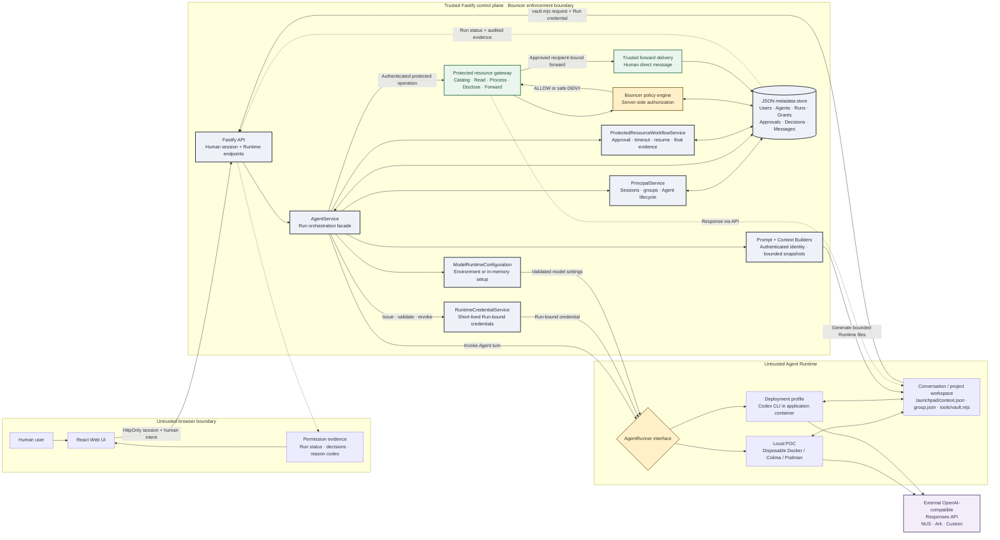

# Agent Launchpad — Bouncer Authorization Middleware

Bouncer is one reusable Track 1 middleware capability: it separates the human
who initiated a Run from the Agent executing it, then enforces protected-data
operations at a trusted backend boundary.

The core story is deliberately narrow and progressive. An attachment grants
`Case` read-and-answer access to one exact resource for one Run. Without an
attachment, any content use—even when the human supplies an exact title—first
requires metadata-only catalog approval and then a separate exact read or
disclosure approval. Forwarding an
unattached own resource first requires catalog approval and file confirmation;
an attached resource can go directly to the separate exact-resource/recipient
approval. Alice cannot authorize Bob's private data.

The UI includes a persistent Chinese/English switch. It translates fixed
interface copy only; user messages, Agent output, protected content, commands,
API paths, and audit reason codes remain unchanged so Agent behavior and
evidence semantics are not altered.

## Why this is middleware

The behavior is enforced across the real React → Fastify → AgentService →
disposable Runtime → protected vault path. It is not a prompt convention or a
front-end-only permission screen.

- Humans and Agents are distinct principals.
- Runtime credentials are opaque, short-lived, stored only as hashes, and bound
  to the human, Agent, Run, conversation, and optional task.
- `read`, sealed `process`, current-conversation `disclose`, and external
  `forward` are separate policy actions.
- Private-catalog existence is absent from the default Runtime context. Alice
  may approve titles, kinds, and creation times for her own catalog without
  granting content access.
- Exact titles are resolved in the backend. Missing, inaccessible, and
  nonexistent references produce the same Runtime-facing failure.
- The Agent may create pending catalog, read, disclosure, or forward requests;
  only a trusted owner decision creates the corresponding Run capability.
- Request creation atomically pauses the logical Run. A decision that arrives
  before the current Agent turn exits is queued and resumed exactly once with a
  fresh credential rather than being lost to a completion race.
- Approved continuations require the final protected-action `ALLOW`, not merely
  an approval record. Prose-only catalog claims are converted into a real
  request, and a skipped approved action is deterministically fulfilled by the
  trusted control plane before the Agent receives its result.
- The backend trace correlates each safe block with its approval through
  `sourceDecisionId`: pending challenges render as waiting, approved retries
  show their final `ALLOW`, and only rejection, expiry, or non-remediable policy
  denial renders as a red terminal state. The low-level `DENY` remains audited.
- The backend delivers the protected body directly to the human-to-human
  conversation; Runtime receives only a receipt.
- Every decision records the human, Agent, action, target, allow/deny result,
  reason code, Run, and policy version with deterministic redaction.
- A middleware evidence contract fails a Run when the Agent merely claims it
  acted without producing the required backend decision.

## Three-minute demo

1. Sign in as Alice and open the seeded Alpha group Agent `Case`.
2. Attach `Alice — Private Interview Notes` and request a summary. Show
   `resource:read = ALLOW / EXPLICIT_PRIVATE_GRANT`.
3. Without an attachment, ask which resources Alice owns. Approve the
   metadata-only catalog request, select the exact title, and separately approve
   read access. Show that catalog approval alone never exposes content.
4. Start without an attachment and ask to send the exact Alice resource to Bob.
   Approve the metadata-only catalog card, confirm the file, then approve the
   recipient-bound forward card. Show `ALLOW / USER_INTENT_BOUND_FORWARD` and
   control-plane delivery in the Alice–Bob conversation.
5. Ask for `Bob — Private Launch Notes` to be sent to Alice. Show
   `DENY / CROSS_OWNER_FORWARD_DENIED`, no approval card, and no protected body.
6. Finish with the permission-evidence window and the successful check output.

The detailed English script is in [docs/DEMO.md](docs/DEMO.md). The one-page
trust-boundary diagram is [output/pdf/bouncer-architecture.pdf](output/pdf/bouncer-architecture.pdf).
The authoritative text state machine is
[docs/PROTECTED_RESOURCE_FLOW.md](docs/PROTECTED_RESOURCE_FLOW.md); diagrams are
updated only after that flow is accepted.

## Run and verify

Requirements: Node.js 22+, npm 10+, Docker/Colima/rootless Podman, and an
OpenAI-compatible Responses API endpoint.

Start from isolated demo state without needing to preconfigure a key:

```bash
npm run demo:fresh
```

Open <http://localhost:3000>. Seeded usernames are `alice`, `bob`, `carol`,
`david`, and `emma`; the local-only demo password is `launchpad-demo`.
After sign-in, the setup dialog accepts an API key, model ID, and OpenAI-compatible
Responses API base URL. NUS SOCaaS and Volcengine Ark presets are included. A
browser-supplied key remains only in server-process memory and is never returned
to the browser or written to application data. Deployers may still preconfigure
a Git-ignored `.env`; that is preferred for a shared production instance.

Run the complete submission check:

```bash
npm ci
npm run check
npm audit --audit-level=low
```

`npm run check` performs TypeScript checks, server tests, and production builds
for both the web app and server. Create a secret-scanned source archive with:

```bash
npm run package:submission -- ../agent-bouncer-submission.zip
```

## Architecture and trusted execution flow

This is both the component architecture and the real call path for a protected
operation. Bouncer is not a separately deployed service. It is the enforcement
boundary formed inside the trusted Fastify control plane by Runtime credentials,
the durable approval workflow, the protected-resource gateway, server-side
policy, and audited evidence.



The model, prompts, browser, and Runtime workspace are not authorization
sources. The generated `context.json`, `group.json`, and `vault.mjs` files cannot
mint a grant. A forward is delivered directly by the trusted control plane and
the protected body is never returned to the model first.

## Trust boundary and limitations

The model, prompt, browser-provided identity fields, and Runtime filesystem are
not authorization sources. The trusted server derives the human from an
`HttpOnly`, `SameSite=Strict` session and evaluates every protected operation
against server-side ownership, membership, grant, Run, and recipient state.

This remains a hackathon POC: accounts are seeded, metadata uses a single-process
JSON store, the local container is not hardened multi-tenant isolation, outbound
network access is broad, and production registration, MFA, managed secrets, and
database transactions are not implemented. See [SECURITY.md](SECURITY.md) and
[docs/IMPLEMENTATION_STATUS.md](docs/IMPLEMENTATION_STATUS.md) for the complete
limitations.

## Primary files

- `apps/server/src/policy.ts` — reusable protected-resource policy.
- `apps/server/src/agent-service.ts` — compatible Run-orchestration facade and trusted enforcement.
- `apps/server/src/principal-service.ts` — human sessions, groups, and Agent lifecycle.
- `apps/server/src/agent-prompt-builder.ts` — authenticated model prompt construction.
- `apps/server/src/runtime-credential-service.ts` — opaque Run credential lifecycle.
- `apps/server/src/protected-resource-workflow.ts` — durable approval and evidence state machine.
- `apps/server/src/runtime-context-builder.ts` — bounded Runtime context snapshots.
- `apps/server/src/app.ts` — authenticated HTTP and Runtime boundaries.
- `apps/web/src/AuthorizationEvidenceWindow.tsx` — human-readable evidence.
- `docs/ARCHITECTURE.md` — architecture and trust boundaries.
- `docs/TRACK_B_DESIGN.md` — policy and product rationale.

License: MIT.
