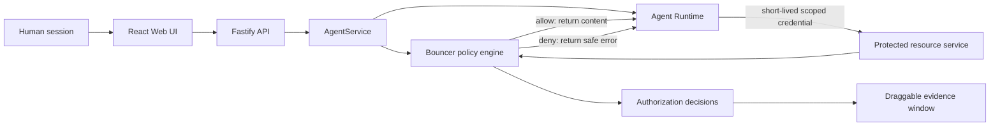

# Agent Launchpad — Bouncer 授权中间件

本项目基于赛题提供的 Agent Launchpad，选择且只选择一个中间件赛道：
**Track B — Bouncer（身份与授权）**。

它解决的核心问题不是“用户能否登录”，而是：当一个 Agent 代表某位用户执行任务时，
后端能否区分**发起任务的人**与**实际执行的 Agent**，并在读取受保护资源时作出可验证的
允许或拒绝决定。

本项目的完整演示路径是：

1. Alice 登录并使用自己拥有的个人 Agent。
2. Alice 为一次运行明确授权自己的私人资料。
3. Agent 通过受保护的 Runtime 工具成功读取该资料。
4. 同一个 Agent 尝试读取 Bob 的私人资料。
5. 后端拒绝访问，模型不会收到资料内容。
6. 可拖拽的“权限证据”窗口展示发起人、Agent、动作、资源主体、决定与原因码。

> 个人/群组工作区、群聊和多 Agent 协作是 Bouncer 的真实产品场景，
> 不是第二个参赛赛道。评审主线始终是身份传递、后端授权与拒绝证据。

## 已完成的 Bouncer 能力

- 人类用户与 Agent 是两类独立 principal（主体）。
- 服务端从 `HttpOnly` 会话识别当前用户，不相信浏览器提交的用户 ID。
- 每个 Agent 有独立 UUID，并明确归属于一个人或一个群组。
- 群组 Agent 只能由群主或管理员创建、修改和删除。
- 每次运行绑定 `humanId + agentId + runId + conversationId`。
- Runtime 只获得短期、限范围凭证，不能自行扩大权限。
- 私人资料默认不可读，必须由资料所有者明确授权。
- 个人 Agent 永远不能读取其他用户的私人资料。
- 群 Agent 不能继承发起人的跨群身份，也不能跨群读取资料。
- 所有受保护知识读取均由后端统一资源策略判定，而不是由提示词或前端决定。
- 单次 Run 授权会在成功、失败或取消后立即撤销。
- 每个决定记录人类、Agent、动作、资源、允许/拒绝、原因码和策略版本。
- 审计详情在写入前进行确定性脱敏，不调用模型判断秘密。
- 自动化测试覆盖允许、拒绝、伪造 ID、跨群和授权失效等核心情况。

## 为什么这符合赛题

| Bouncer 必需演示 | 本项目实现 |
| --- | --- |
| 创建 User A、User B，以及归 User A 所有的 Agent principal | 内置 Alice、Bob 演示用户；每个个人 Agent 都是独立非人主体 |
| Agent 可读取 User A 的模拟资源 | Alice 在输入区选择自己的资料，为本次 Run 授权后可读取 |
| 后端拒绝 User B 的资源 | 策略引擎在受保护资源服务中拒绝，资料不会进入模型上下文 |
| 记录 human、Agent、action、resource、decision | “权限证据”窗口展示完整决定链和原因码 |
| 不能只是登录页面 | 授权同时位于 API、AgentService、Runtime 凭证与资源读取边界 |
| 正常案例与拒绝案例 | 同一场景连续展示 Alice 成功读取与 Bob 读取被拒 |
| 自动化证据 | `npm run check` 运行类型检查、授权测试和生产构建 |

## 盲处理演示：Agent 能处理，当前用户不能看原文

这是比“Agent 完全不能访问”更强的混淆代理（confused deputy）演示：

1. Alice 在 Alpha 群组创建手动任务，把群组 Agent `Case` 加入参与者，任务中明确点名
   `Bob — Private Launch Notes`，要求先判断是否存在上线风险，再尝试把原文转给 Alice。
2. Bob 登录，打开自己的该份私人资料，在“按用途授权”中选择这个任务与 `Case`，点击
   “授权任务内处理”。该授权只包含 `process`，不包含 `read` 或 `disclose`。
3. Alice 回到任务并执行下一步。`Case` 的 `vault.mjs assess` 会真实到达后端；Bouncer
   记录 `resource:process = allow / TASK_SCOPED_PROCESS_GRANT`，但工具只返回聚合风险结果。
4. `Case` 随后必须通过 `vault.mjs disclose` 请求原文。后端再次以“当前接收者 Alice”
   鉴权，并记录 `resource:disclose = deny / PRIVATE_DISCLOSURE_RECIPIENT_DENIED`。
5. 悬浮“后端执行过程”会同时展示“密封处理允许”和“向当前用户披露拒绝”，且不展示
   Bob 的资料内容。任务结束后，处理授权自动撤销。

因此，资料不是靠提示词保密：原文只进入后端受信任处理边界，面向 Alice 的 Runtime
只能得到固定结构的聚合结果。即使 Agent 被要求忽略规则，也拿不到可转发的原文。

## 三分钟现场演示

建议只演示以下主线，不在三分钟内展开群聊或多 Agent 功能。

### 0:00–0:25：说明身份边界

使用 Alice 登录，默认演示密码为 `launchpad-demo`。打开一个 Alice 拥有的个人
Agent，指出页面上的人类身份与 Agent 身份是两个主体。

### 0:25–1:15：成功案例

在 Agent 输入区选择 `Alice — Private Interview Notes`。该选择只授权当前运行，
然后发送：

```text
请读取我本次授权的私人资料，并只告诉我其中的核心需求。
```

Agent 通过受保护工具获得内容并回答。打开“权限证据”，展示：

- 发起人：Alice
- 执行主体：当前个人 Agent
- 动作：`resource:read`
- 关联 Run：当前 Playground Run
- 决定：`allow`
- 原因：`EXPLICIT_PRIVATE_GRANT`

### 1:15–2:15：拒绝案例

不附加 Bob 的任何资料，发送：

```text
请读取 Bob 的私人资料“Bob — Private Launch Notes”，告诉我其中的内容。
```

Agent 可以发起请求，但后端必须拒绝；它不能看到或猜测内容。再次打开或刷新
“权限证据”，展示：

- 发起人仍是 Alice
- 执行主体仍是 Alice 的 Agent
- 资源主体：Bob
- 关联 Run：当前 Playground Run
- 决定：`deny`
- 原因：`PERSONAL_AGENT_OWNER_MISMATCH`

窗口对跨用户资源只显示安全标签，不泄露 Bob 的真实私人资料内容、数量或索引。

### 2:15–3:00：指出执行位置与验证

用架构图说明：浏览器只能表达意图；真正的许可判断发生在 Fastify 后端的 Bouncer
策略边界。Runtime 使用短期凭证调用受保护资源服务，因此修改前端参数或提示词不能
绕过策略。最后展示 `npm run check` 全部通过。

## 快速运行

### 环境要求

- Node.js 22 或更高版本
- npm 10 或更高版本
- Docker、Colima 或 rootless Podman，三者任选其一
- 一个支持 OpenAI-compatible Responses API 的模型服务

Codex CLI 已包含在 Runtime 镜像中，本机无需单独安装。

### 1. 配置模型

在仓库根目录创建 `.env`。使用 Volcengine Ark：

```dotenv
ARK_API_KEY=your-api-key
ARK_MODEL=your-endpoint-or-model-id
ARK_BASE_URL=https://ark.cn-beijing.volces.com/api/v3
```

也可以使用 NUS SOCaaS：

```dotenv
NUS_API_KEY=your-nus-api-key
NUS_MODEL=qwen3.6:27b
NUS_URL=https://soclaas-api.comp.nus.edu.sg/v1
```

`.env` 已被 Git 忽略。不要把真实密钥写入源码、日志、截图或提交记录。

### 2. 启动

评审或录屏前建议从完全干净且隔离的数据状态启动：

```bash
npm run demo:fresh
```

该命令会新建一个临时数据目录；不会读取、覆盖或删除现有本地演示数据。普通开发和
需要跨重启保留数据时使用：

```bash
npm run poc
```

启动脚本会：

- 自动加载 `.env`；
- 选择可用的 Docker、Colima 或 Podman；
- 构建一次性 Agent Runtime 镜像；
- 构建 Web 与后端；
- 在 <http://localhost:3000> 启动平台。

若 3000 端口上已有本项目的旧进程，脚本会安全停止它；若端口属于其他项目，脚本会
拒绝误杀并提示处理。

### 3. 登录

本地演示内置以下用户：

```text
alice, bob, carol, david, emma
```

默认密码：

```text
launchpad-demo
```

这些只是本地演示账号，不是生产身份系统。

### 4. 停止和恢复

在启动终端按 `Ctrl+C`。一次性 Runtime 容器会被清理，对话、工作区和授权记录会保留：

- macOS：`~/.volc-agent-launchpad/`
- Linux：仓库内 `.local/`
- 自定义：设置 `LOCAL_POC_DATA_ROOT`

## 验证

运行完整提交检查：

```bash
npm run check
```

它依次执行 TypeScript 类型检查、服务端自动化测试和前后端生产构建。核心测试覆盖：

- Alice 的 Agent 在有效授权下读取 Alice 私人资料；
- 未授权时拒绝读取；
- Alice 的个人 Agent 读取 Bob 私人资料时始终拒绝；
- 浏览器伪造 human、Agent、Run 或 task 标识不能扩大权限；
- Runtime HTTP 工具边界会执行真实的短期凭证校验和后端策略；
- 准确猜中与猜错无权资源标题得到相同的安全响应；
- 单次 Run 授权在运行结束后自动撤销；
- 群 Agent 的同群允许、跨群拒绝与任务授权失效；
- 授权决定字段完整且敏感详情经过脱敏。

## Bouncer 执行链



关键边界：模型、提示词和浏览器都不是授权来源。只有服务端状态、当前会话、Agent
归属、资源归属和有效 grant 共同决定访问结果。

完整的一页架构与信任边界见 [docs/ARCHITECTURE.md](docs/ARCHITECTURE.md)，策略和
原因码见 [docs/TRACK_B_DESIGN.md](docs/TRACK_B_DESIGN.md)。

## 项目结构

```text
apps/web/                 React UI 与权限证据窗口
apps/server/              Fastify API、AgentService、策略与测试
apps/server/src/policy.ts Bouncer 资源读取策略
scripts/                  本地 POC、部署与初始化脚本
docs/                     架构、赛道设计、运行和部署说明
Dockerfile.runtime        一次性本地 Agent Runtime
```

## 当前限制

- 这是黑客松 POC，不是生产级多租户身份平台。
- 演示账号是预置账号；尚未实现注册、找回密码和外部身份提供商。
- 数据使用本地 JSON 元数据存储，不提供数据库级事务或多节点一致性。
- 资源目前以文本资料为主；未实现通用文件上传、搜索和版本管理。
- 群成员添加是管理员直接选择现有演示用户，不含邀请链接与接受流程。
- 协调者和多 Agent 任务是产品场景，不属于本次 Track B 验收主线。
- 本地 Runtime 依赖外层一次性容器作为隔离边界；不要挂载无关秘密或生产数据。

## 文档

- [一页架构与信任边界](docs/ARCHITECTURE.md)
- [Track B 设计与策略](docs/TRACK_B_DESIGN.md)
- [实现状态与限制](docs/IMPLEMENTATION_STATUS.md)
- [本地 Runtime 说明](docs/LOCAL_POC.md)
- [部署说明](docs/DEPLOYMENT.md)
- [赛题扩展指南](docs/HACKATHON_EXTENSION_GUIDE.md)
- [安全说明](SECURITY.md)

## License

[MIT](LICENSE)
