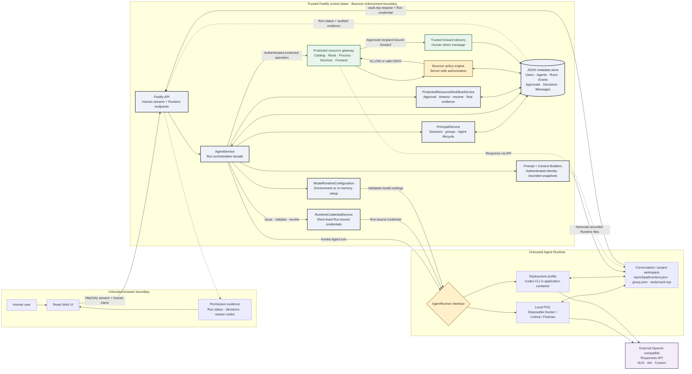

# Agent Launchpad — Bouncer 授权中间件

> English submission overview: [README.en.md](README.en.md)

本项目基于赛题提供的 Agent Launchpad，选择且只实现一条连贯的 middleware 主线：
**Bouncer（身份与授权）**。

它解决的核心问题不是“用户能否登录”，而是：当一个 Agent 代表某位用户执行任务时，
后端能否区分**发起任务的人**与**实际执行的 Agent**，并在读取受保护资源时作出可验证的
允许或拒绝决定。

本项目的完整演示路径是渐进授权：Alice 附加自己的资料后，`Case` 可在当前 Run 直接读取；
没有附件但需要正文时，即使用户点名了精确资料，也必须先审批 Alice 本人目录的最小元数据权限，
再单独审批读取或原文披露；未知资料安全失败。未附加资料的外发也必须先审批目录、确认精确文件，再
审批文件与接收人；已附加资料则可直接进入转发审批。后端直接交付且不把正文返回 Agent。
Alice 不能批准 Bob 的资料。

界面右上角/侧栏提供中文与英文切换并记住本机选择。该功能只切换固定 UI 文案；用户消息、
Agent 输出、资料内容、命令、API 路径和审计原因码保持原样，避免改变 Agent 行为或证据语义。

> 个人/群组工作区、群聊和多 Agent 协作是 Bouncer 的真实产品场景，
> 不是第二个参赛赛道。评审主线始终是身份传递、后端授权与拒绝证据。

## 已完成的 Bouncer 能力

- 人类用户与 Agent 是两类独立 principal（主体）。
- 服务端从 `HttpOnly` 会话识别当前用户，不相信浏览器提交的用户 ID。
- 每个 Agent 有独立 UUID，并明确归属于一个人或一个群组。
- 群组 Agent 只能由群主或管理员创建、修改和删除。
- 每次运行绑定 `humanId + agentId + runId + conversationId`。
- Runtime 只获得短期、限范围凭证，不能自行扩大权限。
- 私人资料默认不可读，必须由资料所有者明确授权。
- 私人资料目录默认连存在性都不暴露；只有发起人可批准当前 Run 查看自己目录的标题、类型和创建时间。
- 精确点名采用后端盲解析；不存在、越权和不可见引用对 Runtime 返回同一失败结果。
- 个人 Agent 永远不能读取其他用户的私人资料。
- 群 Agent 不能继承发起人的跨群身份，也不能跨群读取资料。
- 所有受保护知识读取均由后端统一资源策略判定，而不是由提示词或前端决定。
- `read`、当前对话原文交付和外部 `forward` 是三个独立动作。
- 外部转发必须携带资料所有者、精确资料和已注册接收人；正文由后端直接交付，不返回 Agent。
- Agent 只能创建目录、读取、原文或转发的待审批申请；自由文本、Agent 输出和资料正文均不能生成 grant。
- Alice 永远不能授权转发 Bob 的资料，即使接收人是 Alice 本人。
- Agent 自主提出转发时只能创建资料所有者审批；不能先执行再补审批。
- 单次 Run 授权会在成功、失败或取消后立即撤销。
- 缺少目录、读取、原文或转发授权时会原子创建持久化审批请求并立即暂停同一逻辑 Run；即使审批早于原 Agent 回合结束，也会以新短期凭证准确恢复一次。
- 批准会动态绑定最终动作证据；Agent 若只声称已申请或在恢复后跳过工具，控制面会补建申请或确定性完成获批的精确动作，未产生最终 `ALLOW` 的 Run 不能成功结束。
- 审批默认 5 分钟超时并自动拒绝；等待期间不保留 Runtime 进程或可用凭证。
- 后端过程看板用 `sourceDecisionId` 将安全阻断与审批单关联：待处理显示“需审批/等待”，批准后显示重试的 `ALLOW`；拒绝、超时和不可审批的硬拒绝才显示红色终态。底层 `DENY` 仍完整保留用于审计。
- 每个决定记录人类、Agent、动作、资源、允许/拒绝、原因码和策略版本。
- 任务可声明服务端证据契约；缺少真实策略决策时步骤失败并进入可重试状态。
- Runtime 只记录脱敏后的 vault 操作类型、退出状态和时间，不保存命令参数或工具输出。
- 审计详情在写入前进行确定性脱敏，不调用模型判断秘密。
- 自动化测试覆盖允许、拒绝、伪造 ID、跨群和授权失效等核心情况。

## 为什么这符合赛题

| 本团队选择的 Bouncer 证据 | 本项目实现 |
| --- | --- |
| 创建 User A、User B，以及归 User A 所有的 Agent principal | 内置 Alice、Bob 演示用户；每个个人 Agent 都是独立非人主体 |
| Agent 可读取 User A 的模拟资源 | Alice 在输入区选择自己的资料，为本次 Run 授权后可读取 |
| 后端拒绝 User B 的资源 | 策略引擎在受保护资源服务中拒绝，资料不会进入模型上下文 |
| 记录 human、Agent、action、resource、decision | “权限证据”窗口展示完整决定链和原因码 |
| 不能只是登录页面 | 授权同时位于 API、AgentService、Runtime 凭证与资源读取边界 |
| 正常案例与拒绝案例 | Alice 自有资料允许读取/转发；Bob 私有资料和注入式转发被拒 |
| 自动化证据 | `npm run check` 运行类型检查、授权测试和生产构建 |

## 核心演示：渐进式目录、读取与转发授权

这是一个混淆代理（confused deputy）与资料外泄防护演示：

1. Alice 未附加资料并询问“我有哪些资料”。Agent 调用 `vault.mjs list --owner alice`，
   Bouncer 暂停 Run；Alice 批准后只返回她自己的标题、类型和创建时间，不返回正文。
2. Alice 选择精确资料后，读取仍是独立动作。若资料未附加，即使标题已明确，也先完成目录审批，
   再发起 exact-resource read 申请；若已附加，则附件本身创建仅限当前 Run、仅限该文件的
   `read` grant，无需重复确认。原文披露始终是独立动作；附件不会自动授权披露。
3. Alice 要求转发给 Bob。若文件未附加，Bouncer 先要求本 Run 的目录元数据审批；确认文件后，
   Agent 再创建精确 `(Run, resource, recipient)` 审批。若文件已附加，则直接进入这一步。
   Alice 批准后，Bouncer 记录 `resource:forward = allow / USER_INTENT_BOUND_FORWARD`，后端
   把资料直接写入 Alice 与 Bob 的私聊，Runtime 只收到不含正文的交付回执。
4. Alice 再要求“把 Bob — Private Launch Notes 发给我”。后端记录
   `resource:forward = deny / CROSS_OWNER_FORWARD_DENIED`，且不会生成 Alice 可批准的卡片。
5. 当资料正文诱导 Agent 转发、但 Alice 没有发出转发指令时，后端记录
   `HUMAN_FORWARD_INTENT_REQUIRED` 并保持资料未交付。

因此，授权不是靠提示词声明：是否允许外部交付由后端核对所有权、用户消息来源、Run、
资料和接收人。即使 Agent 被资料内容诱导，也无法自行制造用户授权。

受保护动作必须产生与当前 Run 绑定的真实后端策略决定；Agent 只回复“将调用工具”不会创建
grant、审批或交付回执。任务场景还可显式声明 middleware 证据契约，缺少绑定决定时步骤失败。

## 三分钟现场演示

建议演示“一次目录审批 + 一次外发审批 + 一次跨所有者拒绝”。每次批准都会销毁旧 Runtime
凭证，并以新短期凭证恢复同一逻辑 Run；拒绝或超时则在不泄漏正文的情况下恢复。

### 0:00–0:45：正常读取

Alice 打开 `Case`，附加 `Alice — Private Interview Notes` 并要求总结。展示
`resource:read = allow / EXPLICIT_PRIVATE_GRANT`，说明附加动作已经是本次 Run 的读取授权，
不会再弹一次确认。

### 0:45–1:20：目录与读取申请

Alice 不附加资料，询问“我有哪些资料”。批准目录元数据申请；随后点名一份资料并批准读取。
展示目录批准没有自动授予正文权限。

完整文字状态机见 [docs/PROTECTED_RESOURCE_FLOW.md](docs/PROTECTED_RESOURCE_FLOW.md)。流程图和
PDF 将在该文字流程验收后再统一更新。

### 1:20–2:00：明确转发

Alice 不附加资料，输入“把 Alice — Private Interview Notes 发给 Bob”。先批准仅元数据目录卡，
确认文件存在，再在转发审批卡核对精确资料和接收人：

- `POST /api/runtime/resources/catalog`；
- `POST /api/runtime/resources/forward`；
- `200 ALLOW / USER_INTENT_BOUND_FORWARD`；
- `approval:approve / RESOURCE_OWNER_APPROVED`；
- Bob 的私聊中出现后端交付的资料；
- Agent 回复和工具回执中没有资料正文。

### 2:00–2:35：跨所有者硬拒绝

Alice 输入“把 Bob — Private Launch Notes 发给我”。展示
`403 DENY / CROSS_OWNER_FORWARD_DENIED`，并指出 Alice 不是资料所有者，因此不会出现
“让 Alice 自己批准”的错误审批卡。

### 2:35–3:00：证据与生命周期

展示权限证据中的 human、Agent、Run、resource、recipient 和原因码，以及 Run 结束后的
凭证/未消费意图撤销。最后展示自动化测试。备用路径可演示 Agent 使用 `request-forward`
提起主对话审批，拒绝或超时后安全恢复。

## 快速运行

### 环境要求

- Node.js 22 或更高版本
- npm 10 或更高版本
- Docker、Colima 或 rootless Podman，三者任选其一
- 一个支持 OpenAI-compatible Responses API 的模型服务

Codex CLI 已包含在 Runtime 镜像中，本机无需单独安装。

### 1. 配置模型

最方便的本地验收方式是不预先配置密钥，直接运行 `npm run poc`。平台启动后登录，页面会自动
打开“配置模型即可开始”，依次填写 API Key、模型 ID 和 Responses API 根地址。NUS SOCaaS
已提供预设；也可以选择 Volcengine Ark 或任意兼容服务。浏览器提交的密钥只保存在当前服务
进程内，不写入项目数据库、不返回前端，服务重启后需要重新填写。

部署者也可以用 Git 忽略的 `.env` 预置全实例配置。使用 Volcengine Ark：

```dotenv
ARK_API_KEY=your-api-key
ARK_MODEL=your-endpoint-or-model-id
ARK_BASE_URL=https://ark.cn-beijing.volces.com/api/v3
```

也可以使用 NUS SOCaaS：

```dotenv
NUS_API_KEY=your-nus-api-key
NUS_MODEL=qwen3.6:27b
NUS_URL=https://soclaas-api.comp.nus.edu.sg/v1
```

`.env` 已被 Git 忽略。不要把真实密钥写入源码、日志、截图或提交记录。
网页配置适合本地验收和单实例演示；共享生产实例应由部署者预置凭据，避免多个访问者互相
替换实例级模型配置。切换配置前平台会要求先结束或停止正在运行/等待审批的 Run。

### 2. 启动

评审或录屏前建议从完全干净且隔离的数据状态启动：

```bash
npm run demo:fresh
```

该命令会新建一个临时数据目录；不会读取、覆盖或删除现有本地演示数据。普通开发和
需要跨重启保留数据时使用：

```bash
npm run poc
```

干净状态会预置演示用户、两组资料与 Alpha 群组 Agent `Case`，但不会预置任务、授权
或成功记录；因此每次演示的证据仍来自现场创建的 task 和真实后端决策。

启动脚本会：

- 自动加载 `.env`；
- 选择可用的 Docker、Colima 或 Podman；
- 构建一次性 Agent Runtime 镜像；
- 构建 Web 与后端；
- 在 <http://localhost:3000> 启动平台。

若 3000 端口上已有本项目的旧进程，脚本会安全停止它；若端口属于其他项目，脚本会
拒绝误杀并提示处理。

### 3. 登录

本地演示内置以下用户：

```text
alice, bob, carol, david, emma
```

默认密码：

```text
launchpad-demo
```

这些只是本地演示账号，不是生产身份系统。

### 4. 停止和恢复

在启动终端按 `Ctrl+C`。一次性 Runtime 容器会被清理，对话、工作区和授权记录会保留：

- macOS：`~/.volc-agent-launchpad/`
- Linux：仓库内 `.local/`
- 自定义：设置 `LOCAL_POC_DATA_ROOT`

## 验证

运行完整提交检查：

```bash
npm run check
```

它依次执行 TypeScript 类型检查、服务端自动化测试和前后端生产构建。核心测试覆盖：

- Alice 的 Agent 在有效授权下读取 Alice 私人资料；
- 未授权时拒绝读取；
- Alice 的个人 Agent 读取 Bob 私人资料时始终拒绝；
- 浏览器伪造 human、Agent、Run 或 task 标识不能扩大权限；
- Runtime HTTP 工具边界会执行真实的短期凭证校验和后端策略；
- Bouncer 证据契约满足时 Run 完成，缺少真实请求时 Run/步骤失败并可重试；
- vault 命令观测只保留操作类型和状态，不保存受保护标题、参数或输出；
- 准确猜中与猜错无权资源标题得到相同的安全响应；
- 单次 Run 授权在运行结束后自动撤销；
- 群 Agent 的同群允许、跨群拒绝与任务授权失效；
- 授权决定字段完整且敏感详情经过脱敏。

## 架构与可信执行流

下图同时概括组件关系、部署分支和一次受保护操作的真实调用链，可直接作为本项目的
**架构流程图**。Bouncer 不是单独部署的服务，而是 Fastify 可信控制面内由 Runtime
凭证、审批状态机、资源网关、服务端策略和审计证据共同形成的强制边界。



关键边界：模型、提示词、浏览器和 Runtime 工作区都不是授权来源；`context.json`、
`group.json` 与 `vault.mjs` 也不能自行授予权限。只有服务端会话、主体归属、当前 Run、
资源所有权、有效 grant 和策略状态共同决定结果。`forward` 的正文由可信控制面直接投递，
不会先返回模型。

完整的一页架构与信任边界见 [docs/ARCHITECTURE.md](docs/ARCHITECTURE.md)，策略和
原因码见 [docs/TRACK_B_DESIGN.md](docs/TRACK_B_DESIGN.md)。

## 项目结构

```text
apps/web/                                      React UI、模型配置与权限证据窗口
apps/server/src/app.ts                         Human / Runtime HTTP 边界
apps/server/src/agent-service.ts               Run 编排兼容门面
apps/server/src/principal-service.ts           会话、群组与 Agent 生命周期
apps/server/src/protected-resource-workflow.ts 审批、超时、恢复与最终证据状态机
apps/server/src/runtime-credential-service.ts  短期 Run 凭证生命周期
apps/server/src/agent-prompt-builder.ts         基于可信身份构建模型提示
apps/server/src/runtime-context-builder.ts      有界 Runtime 上下文快照
apps/server/src/policy.ts                       Bouncer 服务端资源策略
scripts/                                       本地 POC、部署与初始化脚本
docs/                                          架构、赛道设计、运行和部署说明
Dockerfile.runtime                             一次性本地 Agent Runtime
```

## 当前限制

- 这是黑客松 POC，不是生产级多租户身份平台。
- 演示账号是预置账号；尚未实现注册、找回密码和外部身份提供商。
- 数据使用本地 JSON 元数据存储，不提供数据库级事务或多节点一致性。
- 资源目前以文本资料为主；未实现通用文件上传、搜索和版本管理。
- 群成员添加是管理员直接选择现有演示用户，不含邀请链接与接受流程。
- 协调者和多 Agent 任务是产品场景，不属于本次 Bouncer 提交主线。
- 本地 Runtime 依赖外层一次性容器作为隔离边界；不要挂载无关秘密或生产数据。

## 提交前清理

公开仓库或提交 ZIP 不应包含 `.env`、`node_modules`、`.data`、Runtime `workspaces`
或 `codex-home`。只提交源码、lockfile、文档和受控测试 fixture；通过 `.env.example`
说明配置，并在干净环境执行 `npm ci && npm run check`。生成经过黑名单复检的提交包：

```bash
npm run package:submission
```

## 文档

- [一页提交架构图](output/pdf/bouncer-architecture.pdf)
- [架构与信任边界说明](docs/ARCHITECTURE.md)
- [三分钟演示脚本](docs/DEMO.md)
- [Bouncer 设计与策略](docs/TRACK_B_DESIGN.md)
- [实现状态与限制](docs/IMPLEMENTATION_STATUS.md)
- [本地 Runtime 说明](docs/LOCAL_POC.md)
- [部署说明](docs/DEPLOYMENT.md)
- [赛题扩展指南](docs/HACKATHON_EXTENSION_GUIDE.md)
- [安全说明](SECURITY.md)

## License

[MIT](LICENSE)
