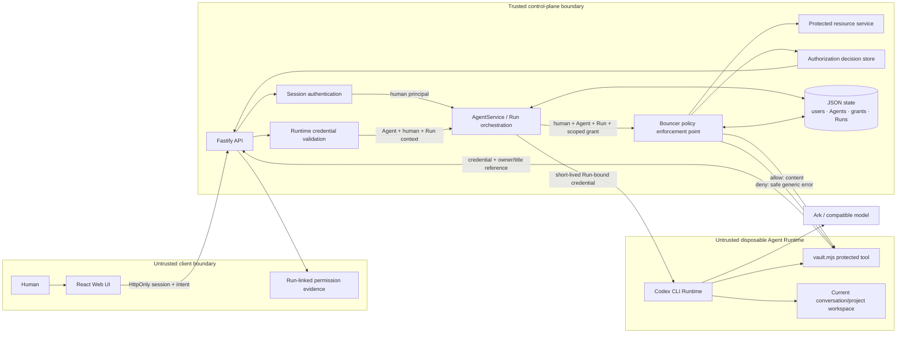

# One-page Architecture — Bouncer Middleware

This submission adds one middleware story to the Starter Kit: a trusted Bouncer
boundary that separates the initiating human from the executing Agent and
authorizes protected resource reads. Browser state, prompts, model output, and
Runtime files are never authorization sources.



The two enforcement outcomes use the same path. An allowed read returns content
only after the server validates the current human, Agent ownership, Run-bound
credential, resource owner, active grant, and policy version. A denied read
returns no content, stores the specific internal reason, and exposes only a safe
error at the Runtime boundary.

## Components

### Web UI

Lists Agents, manages lifecycle actions, submits prompts, and polls asynchronous
Runs. It never receives the Ark API key.

### Fastify API

Validates requests, resolves the signed-in human from an opaque `HttpOnly`
session, accepts short-lived Runtime credentials on `/api/runtime/*`, and serves
the compiled Web UI. The optional remote-demo bearer token is not user identity
or Agent authorization.

### Bouncer policy enforcement point

Every protected knowledge read reaches the same resource policy. The decision
input is server-derived: initiating human, executing Agent, Run/task context,
resource ownership, memberships, active grants, and current Agent status.
Specific denial reasons are persisted for audit, while inaccessible and
nonexistent resource references produce the same Runtime response so private
titles cannot be confirmed by probing.

### Processing is not disclosure

Task-scoped grants to group Agents are purpose-limited `process` grants. The
protected processor may inspect the resource inside the Bouncer boundary and
return a fixed aggregate (`risk_signals_present` or
`no_risk_signals_found`), but it never returns source text to the user-facing
Runtime. A request to quote, copy, summarize in detail, or forward the source
must use the separate disclosure action. Disclosure is authorized against the
initiating human as the recipient, so a task initiated by Alice can process a
Bob-owned resource with Bob's grant while still denying disclosure to Alice.

Both actions are audited independently as `resource:process` and
`resource:disclose`. This avoids relying on an LLM prompt as the confidentiality
boundary and provides a real allow-then-deny backend trace for the demo.

For the live scenario, a task may also carry an explicit middleware evidence
contract. The contract is copied onto its Run and checked against persisted,
Run-linked authorization decisions after the Runtime returns. Missing required
decisions fail the Run and coordination step, preserve a safe diagnostic, and
use the existing step retry flow. Agent prose cannot satisfy the contract.

Codex command events are used only to distinguish “vault was never invoked”
from “vault ran but no policy decision was linked.” Stored tool metadata contains
only the vault operation, exit status, and timestamp; command arguments and tool
output are discarded.

### AgentService

Coordinates authenticated humans, Agent principals, conversations, task projects,
policy decisions, scoped Runtime credentials, and Runs. One Agent can have only
one active Run. Runtime state is keyed by `(agentId, conversationId)`; it is not
stored on the Agent itself. A Run credential is held only in memory as a token
hash and is deleted when execution ends. Run-scoped resource grants are revoked
on success, failure, or cancellation.

```text
ready -> busy -> ready
  |       |
  v       v
stopped  error
```

Interrupted Runs become `cancelled` after a restart.

### Storage

```text
data/launchpad.json                 Identity, policy, conversation, coordination, and Run state
workspaces/users/UserID/shared/     Personal owner-level shared files
workspaces/users/UserID/projects/   Personal projects
workspaces/groups/GroupID/shared/   Group owner-level shared files
workspaces/groups/GroupID/projects/ Group task projects
codex-home/                         Codex configuration and sessions
```

`JsonStore` serializes writes and atomically replaces one JSON file. It supports
one process only.

Before each Runtime call, the server writes a bounded `.launchpad/context.json`
snapshot into the current conversation/project directory. Project files are
read-write; owner-level `shared/` files can be read only through a scoped control-
plane tool. Publishing project output to `shared/` requires hash-bound human
approval.

Group Runs also receive `.launchpad/group.json`, regenerated from the JSON
store immediately before execution. It is the complete current group roster
and knowledge index for that Run, including exact human and Agent counts;
conversation history is not a membership source. Both manifest files are
read-only evidence for the model, while authorization remains enforced by the
server.

### Runtime providers

- `CodexRunner` runs Codex inside the application container for ECS.
- `ContainerCodexRunner` starts one disposable Docker, Colima, or Podman
  container for every local turn.

Both providers use argv-only process execution, bound output and time, resume
the stored Codex thread, and escalate termination after a grace period.

## Deployment profiles

| Profile | Control plane | Agent execution |
| --- | --- | --- |
| Local POC | Host Node.js | Disposable local container |
| ECS | Application container | Codex process in the same container |
| Local development | Host Node.js | Host Codex process |

## Bouncer contracts

| Contract | Trusted owner | Failure behavior |
| --- | --- | --- |
| Human session | Fastify API and server session store | `401`; request body cannot replace identity |
| Agent/Run credential | AgentService and in-memory token hash map | `401`; token expires and is deleted after the Run |
| Protected read decision | Bouncer resource policy | no content; safe Runtime error; specific audited reason |
| Authorization evidence | append-only decision records | correlated by human, Agent, Run/task, action, target, and policy version |
| Middleware evidence contract | AgentService Run finalization | missing decisions fail the Run/step and expose Retry instead of a false completed state |

The current container or ECS instance is the POC trust boundary. Ordinary
containers are not hardened multi-tenant isolation.
